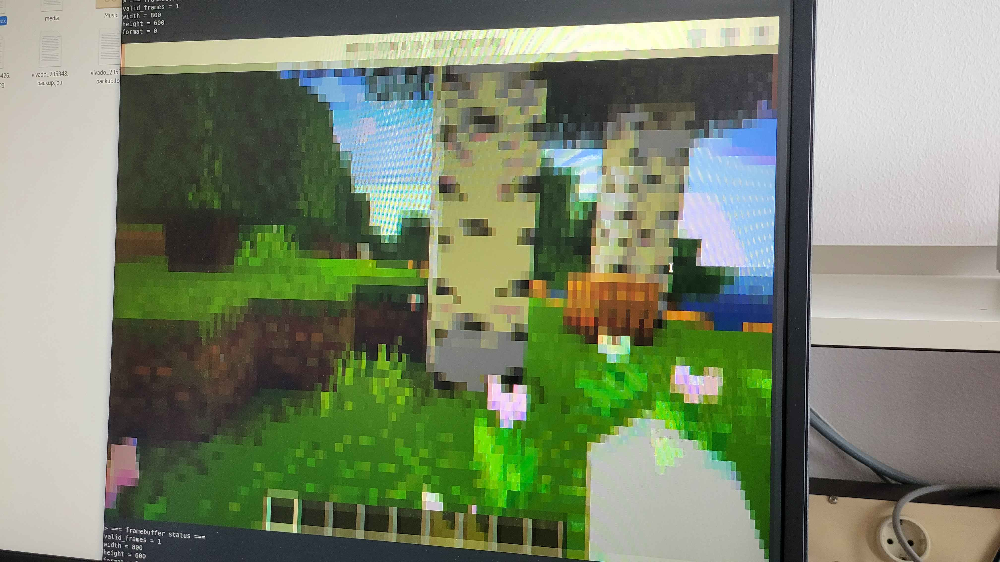

# DVI/HDMI input for the Artix-7 FPGA with TileLink interface

This project is a DVI/HDMI-compatible video input for the Artix-7 FPGA and Nexys Video board
which was developed as part of the lecture "System-on-Chip (SoC) + RISC-V Lab"
at [Technische Universität Berlin](https://www.tu.berlin/) in 2024.

It is designed to communicate with a central processor using a TileLink Uncached Lightweight (TL-UL)
interface and to be easily configurable and adaptable.

## Features
- modular HDMI/DVI input written in System Verilog
- simple hardware access layer written in C
- two framebuffers, so one can be written by the hardware while the other is read by the software
    - can be used as a single framebuffer to provide high-depth colors or high-resolution images
- configurable row and column skipping to capture high resolutions that do not fit into memory
- freely configurable EDID memory
- example application with additional support for showing captured images in terminal

### Tested display modes
| Resolution | Refresh Rate | DVI | HDMI | needs `high_res` | needs skipping |
|---|---|---|---|---|---|
| 640x480 | 60 Hz | ✅ yes | ✅ yes | no | no |
| 800x600 | 60 Hz | ✅ yes | ✅ yes | no | no |
| 1024x768 | 60 Hz | ✅ yes | ✅ yes | yes | no |
| 1280x720 | 60 Hz | ✅ yes | ✅ yes | yes | no |
| 1920x1080 | 15 Hz | ✅ yes | ✅ yes | yes | yes |

(Tested on Nexys Video board)

## Design

### Hardware Design

### Software Design

